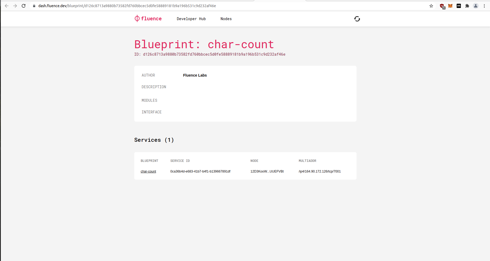
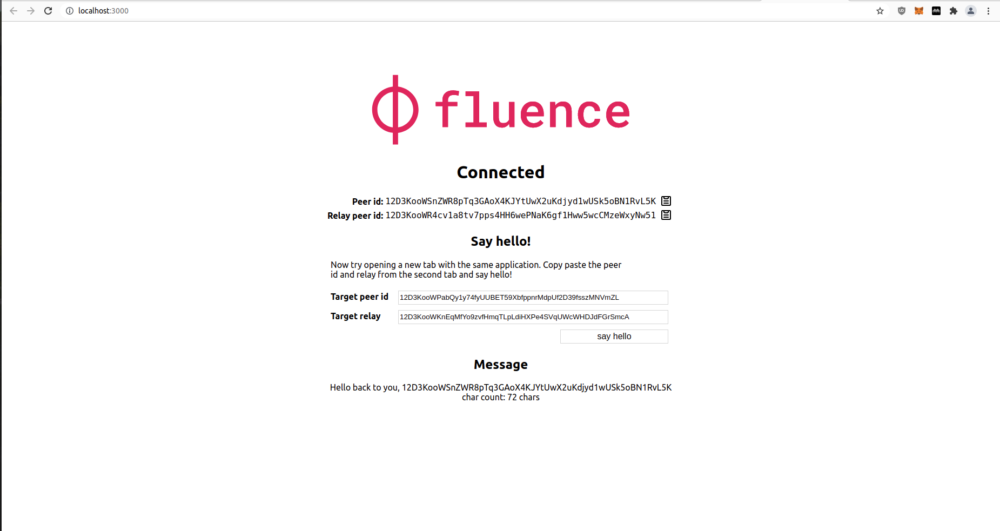

# 4. Char count service

## Creating A WebAssembly Module

In this section, we develop a ```CharCount``` service, host it on a peer-to-peer node of the Fluence testnet and interact with app.

In your VSCode terminal the ```4-char-count-service``` directory run:

```cd hosted-service```

Based on ```2-hosted-services``` example the following service was created:

```
// quickstart/4-char-count-service/hosted-service/src/main.rs
use marine_rs_sdk::marine;
use marine_rs_sdk::module_manifest;

module_manifest!();

pub fn main() {}

#[marine]
pub struct CharCount {
    pub msg: String,
    pub count: String,
}

#[marine]
pub fn character_count(message: String) -> CharCount {
    CharCount {
        msg: format!("{}", message),
        count: format!("{} chars", message.len()),
    }
}
```

Here you can see the ```character_count``` function take a string parameter and return the ```CharCount``` struct consisting of the ```msg``` and ```count``` field. 

Run ```./scripts/build.sh``` to compile the code to the WASM target.

## Testing Wasm Code

```
// quickstart/4-char-count-service/hosted-service/src/main.rs
#[cfg(test)]
mod tests {
    use marine_rs_sdk_test::marine_test;

    #[marine_test(config_path = "../configs/Config.toml", modules_dir = "../artifacts")]
    fn non_empty_string(char_count: marine_test_env::char_count::ModuleInterface) {
        let actual = char_count.character_count("Vincent".to_string());
        assert_eq!(actual.msg, "Vincent".to_string());
        assert_eq!(actual.count, "7 chars");
    }

    #[marine_test(config_path = "../configs/Config.toml", modules_dir = "../artifacts")]
    fn empty_string(char_count: marine_test_env::char_count::ModuleInterface) {
        let actual = char_count.character_count("".to_string());
        assert_eq!(actual.msg, "".to_string());
        assert_eq!(actual.count, "0 chars");
    }

    #[marine_test(config_path = "../configs/Config.toml", modules_dir = "../artifacts")]
    fn have_space(char_count: marine_test_env::char_count::ModuleInterface) {
        let actual = char_count.character_count("A char count service".to_string());
        assert_eq!(actual.msg, "A char count service".to_string());
        assert_eq!(actual.count, "20 chars");
    }
}
```

For tests running use the ```cargo +nightly test --release``` command.

## Interact with Marine REPL

In your VSCode terminal the ```4-char-count-service/hosted-service``` directory run:

```
mrepl configs/Config.toml
```

which puts us in the REPL:

```
mrepl configs/Config.toml
Welcome to the Marine REPL (version 0.9.1)
Minimal supported versions
  sdk: 0.6.0
  interface-types: 0.20.0

app service was created with service id = a99c3c91-4aa9-467b-b53e-23bfe5b4c8ed
elapsed time 46.651078ms

1> i
Loaded modules interface:
data CharCount:
  msg: string
  count: string

char_count:
  fn character_count(message: string) -> CharCount

2> call char_count character_count ["Hello, my name is Vincent"]
result: Object({"count": String("25 chars"), "msg": String("Hello, my name is Vincent")})
 elapsed time: 139.441µs

3>
```

## Exporting WebAssembly Interfaces To Aqua

```
marine aqua artifacts/char_count.wasm
```

Which gives us the Aqua-ready interfaces:

```
module CharCount declares *

data CharCount:
  msg: string
  count: string

service CharCount:
  character_count(message: string) -> CharCount
```

## Deploying A Wasm Module To The Network

In your VSCode terminal:

```
fldist env
```

Which gets us a list of network peers:

```
/dns4/kras-00.fluence.dev/tcp/19990/wss/p2p/12D3KooWSD5PToNiLQwKDXsu8JSysCwUt8BVUJEqCHcDe7P5h45e
/dns4/kras-00.fluence.dev/tcp/19001/wss/p2p/12D3KooWR4cv1a8tv7pps4HH6wePNaK6gf1Hww5wcCMzeWxyNw51
/dns4/kras-01.fluence.dev/tcp/19001/wss/p2p/12D3KooWKnEqMfYo9zvfHmqTLpLdiHXPe4SVqUWcWHDJdFGrSmcA
/dns4/kras-02.fluence.dev/tcp/19001/wss/p2p/12D3KooWHLxVhUQyAuZe6AHMB29P7wkvTNMn7eDMcsqimJYLKREf
/dns4/kras-03.fluence.dev/tcp/19001/wss/p2p/12D3KooWJd3HaMJ1rpLY1kQvcjRPEvnDwcXrH8mJvk7ypcZXqXGE
/dns4/kras-04.fluence.dev/tcp/19001/wss/p2p/12D3KooWFEwNWcHqi9rtsmDhsYcDbRUCDXH84RC4FW6UfsFWaoHi
/dns4/kras-05.fluence.dev/tcp/19001/wss/p2p/12D3KooWCMr9mU894i8JXAFqpgoFtx6qnV1LFPSfVc3Y34N4h4LS
/dns4/kras-06.fluence.dev/tcp/19001/wss/p2p/12D3KooWDUszU2NeWyUVjCXhGEt1MoZrhvdmaQQwtZUriuGN1jTr
/dns4/kras-07.fluence.dev/tcp/19001/wss/p2p/12D3KooWEFFCZnar1cUJQ3rMWjvPQg6yMV2aXWs2DkJNSRbduBWn
/dns4/kras-08.fluence.dev/tcp/19001/wss/p2p/12D3KooWFtf3rfCDAfWwt6oLZYZbDfn9Vn7bv7g6QjjQxUUEFVBt
/dns4/kras-09.fluence.dev/tcp/19001/wss/p2p/12D3KooWD7CvsYcpF9HE9CCV9aY3SJ317tkXVykjtZnht2EbzDPm
```

Let's use the peer ```12D3KooWFtf3rfCDAfWwt6oLZYZbDfn9Vn7bv7g6QjjQxUUEFVBt```. 

In the ```quickstart/4-char-count-service/hosted-service``` directory run:

```
fldist --node-id 12D3KooWFtf3rfCDAfWwt6oLZYZbDfn9Vn7bv7g6QjjQxUUEFVBt \
       new_service \
       --ms artifacts/char_count.wasm:configs/char_count_cfg.json \
       --name char-count
```

Which gives us a unique service id:

```
service id: a9a2bdcd-8463-4176-91cf-19344b93461c
service created successfully
```

We can check it on [Fluence Developer Hub](https://dash.fluence.dev/)



Take note of the service id: ```a9a2bdcd-8463-4176-91cf-19344b93461c``` will be use in ```4-char-count-service```

## Update aqua with the new service

Update ```4-char-count-service/aqua/getting-started.aqua```

```
import "@fluencelabs/aqua-lib/builtin.aqua"

// <snip>

const charCountNodePeerId ?= "12D3KooWFtf3rfCDAfWwt6oLZYZbDfn9Vn7bv7g6QjjQxUUEFVBt"
const charCountServiceId ?= "a9a2bdcd-8463-4176-91cf-19344b93461c"

data CharCount:
  msg: string
  count: string

-- The service runs on a Fluence node
service CharCount:
    character_count(message: string) -> CharCount

-- The service runs inside browser
service CharCountPeer("CharCountPeer"):
    character_count(message: string) -> string

func charCount(targetPeerId: PeerId, targetRelayPeerId: PeerId, msg: string) -> string:
    -- execute computation on a Peer in the network
    on charCountNodePeerId:
        CharCount charCountServiceId
        comp <- CharCount.character_count(msg)

    -- send the result to target browser in the background
    co on targetPeerId via targetRelayPeerId:
        res <- CharCountPeer.character_count(comp.count)

    -- send the result to the initiator
    <- comp.count
```

Now compile aqua file with ```npm run compile-aqua``` and run the application with ```npm start```

## Play with app

Which will open a new browser tab at ```http://localhost:3000``` . Following the instructions, we connect to any one of the displayed relay ids, open another browser tab also at ```http://localhost:3000```, select a relay and copy and paste the client peer id and relay id into corresponding fields in the first tab and press the say hello button.

You will see the message and char count for this message


