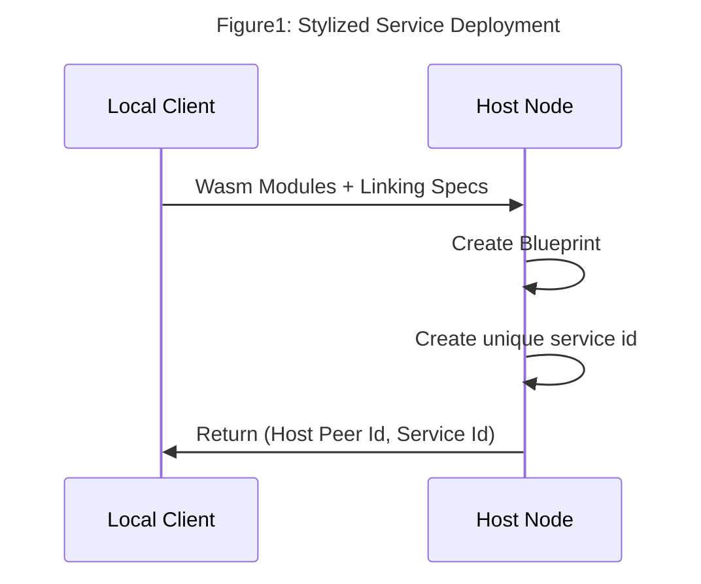
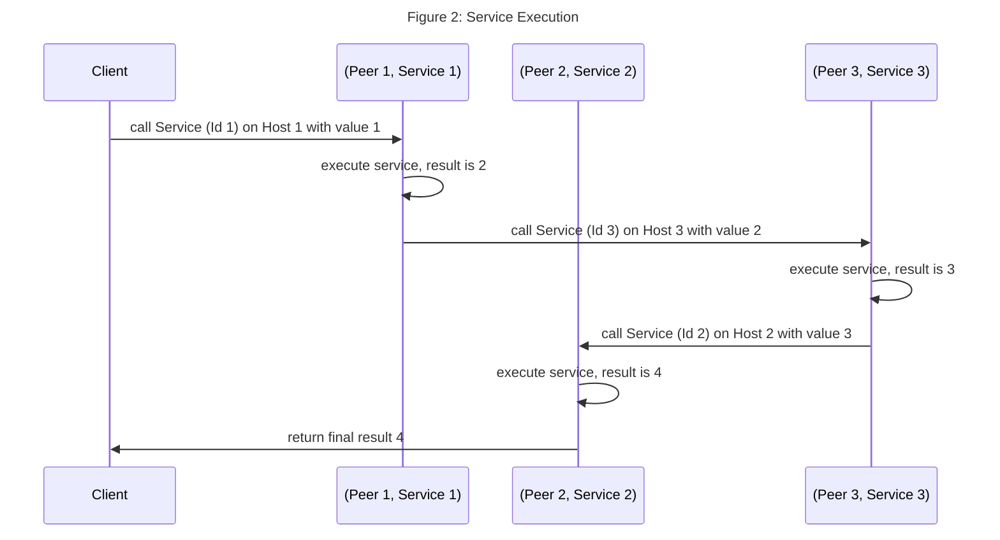

# Section 4, Quickstart, Composing Services

**move to documentation when done**

In the previous three sections, you got a bit of a taste of using Aqua. In this section, we discuss how to compose an application from multiple distributed services using Aqua. In Fluence, we don't use JSON-RPC or REST endpoints to address and execute the service, we use [Aqua](https://github.com/fluencelabs/aqua) and the underlying Fluence peer-to-peer stack to find and execute services. Specifically, Aqua is a purpose-built distributed systems and peer-to-peer programming language that resolves (Peer Id, Service Id) tuples to facilitate service execution on the host node without developers having to worry about transport or network routing.

## Composition With Aqua

A service is one or more linked WebAssmebly (Wasm) modules as specified by the blueprint and assigned an unique service id, which is the result of the deployment of the blueprint and initiation on the host we chose for deployment.




When we deploy our service, as demonstrated in section two, the service is "out there" on the network and we need to find a way to access and execute the service. The (Peer Id, Service Id) tuple we obtain from the service deployment process contains all the information we need to locate, i.e., address, and execute the service.

Assume we have a Wasm module that adds one to an input, i.e.
```rust
#[marine]
fn add_one(input: u64) -> u64 {
    input + 1
}
```

and we deploy that module as a service to three hosts: Peer 1, Peer 2, and Peer 3. Once we got the services deployed to their respective hosts, we can use Aqua to compose an admittedly simple application by specifying execution the workflow of each service where the (Peer Id, Service Id) facilitates the routing and execution. Also, recall that in the Fluence peer-to-peer programming model the client need not, and for the most part should not, be involved in managing intermediate results. Instead, results can be "forward chained" to the next service as specified in the Aqua workflow.

Using our "add 1" service and starting with an input param value of one, utilizing all three services, we expect a final result of four given **seq**uential service execution: 
 


The underlying Aqua script may look something like this:

```aqua

-- service interface for Wasm module
service AddOne:
    add_one: u64 -> u64
    
-- convenience struc for (Peer Id, Service Id) tuples
data NodeServiceTuple:
    node_id: string
    service_id: string

-- our app as defined by the worflow expressed in Aqua
func add_one_three_times(value: u64, ns_tuples: []NodeServiceTuple) -> u64:
    res: *u64
    on ns_tuples!0.node_id:
        AddOne ns_tuples!0.service_id
        res <- AddOne.add_one(value)

    on ns_tuples!1.node_id:
        AddOne ns_tuples!1.service_id
        res <- AddOne.add_one(res!0)

    on ns_tuples!2.node_id:
        AddOne ns_tuples!2.service_id
        res <- AddOne.add_one(res!0)
    <- res!0                            --< return the final result to the client
```
